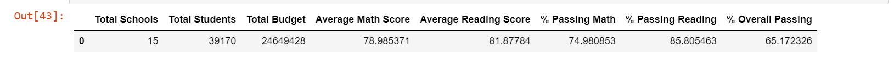
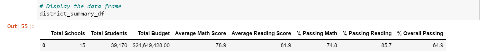

# School_District_Analysis

## Project Overview
The purpose for this project was to delete math and reading scores of Thomas High School ninth graders as they appear to have been changed in the original data source. The code, [PyCitySchools Challenge](https://github.com/jinnabelle/School_District_Analysis/blob/main/PyCitySchools_Challenge.ipynb), shows steps on how to determine and delete the altered math and reading grades of the Thomas High School ninth graders. The analysis looks at the student performance by school, and it looks at the difference in performance with the exclusion of the grades from the Thomas High School 9th graders.

## Resources
- Data Source: schools.csv, students_complete.csv
- Software: Python 3.7 (Pandas), Jupyter

## Results 
The analysis takes out the Thomas High School 9th graders from the total scores and school performance to avoid the inaccurate results from the school. In total, there were 461 students that had their scores nullified. With this, the results below shows how performance at the total, district, and school level is affected by the change.

* How is the district summary affected?
There difference between the summaries is minimal. This is likely due to the number of student scores taken out of the total population of students (461 out of the almost 40,000 students in the dataset).  The metrics affected by the change are percent of students passing individual subjects (math and reading) and passing overall.  
**Original District Summary** 
 
**Updated District Summary** 
 

* How is the school summary affected?
* How does replacing the ninth graders’ math and reading scores affect Thomas High School’s performance relative to the other schools?
* How does replacing the ninth-grade scores affect the following:
* Math and reading scores by grade
* Scores by school spending
* Scores by school size
* Scores by school type

## Summary
Summary: Summarize four changes in the updated school district analysis after reading and math scores for the ninth grade at Thomas High School have been replaced with NaNs.
